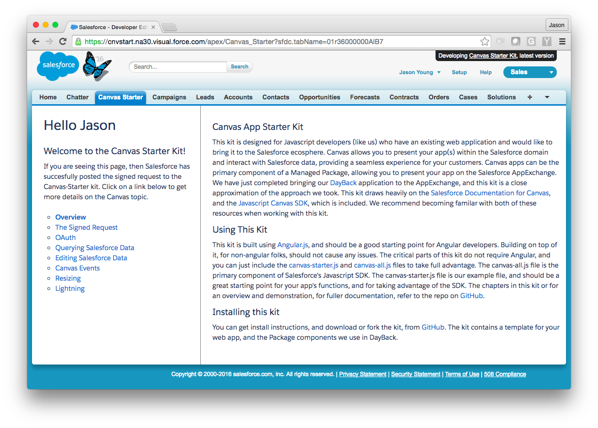

# Canvas Starter Kit
This kit is designed for Javascript developers who want to build a Salesforce app using the Force.com Canvas Framework. It can serve as starting point or template for building your own Canvas app and publishing it as a Managed Package on the [AppExchange](https://appexchange.salesforce.com/).

### We've been there!
This kit is the result of our journey bringing our [DayBack Web App](http://DayBack.Com) to the Salesforce [AppExchange](https://appexchange.salesforce.com/listingDetail?listingId=a0N30000000qp64EAA). We learned a lot during this experience, some things easy, some things a little harder and wanted to share those with people who are where we were when we started. We also wanted to provide a simpler "Hello World" Experience for prospective Canvas users. The Java example provided by Salesforce is very good, but a little complicated for Javascript folks (like us) who are maybe a little more comfortable with a simple PHP page than a full Java web app.

### Help us out!
We are very pleased with how we incorporated our app using the techniques in this kit, but we're sure there are better methods we missed (or mis-understood), so please contribute to improving this kit.

### What's in the kit?
##### Package Components:
- Visualforce Code for creating a Canvas app in a VF page
- Static Resource Javascript that provides:
  - Resizing your Canvas app within the tab
  - Navigation in Salesforce from the Canvas app
  - A template for publishing and subscribing to events between the VF page and the Canvas app
  - Functionality across VF, Lightning and SF1
- Static Resource CSS for optimizing the Visualforce page in the Tab for VF, Lightning and SF1.
- Apex Classes that allow an Org to use its own Static Resource in an installed Managed Package.

##### App Components:
- [The Salesforce Canvas Javascript SDK](https://github.com/forcedotcom/SalesforceCanvasJavascriptSDK)
- A basic PHP page for authenticating your Canvas app with Salesforce
- A basic OAuth.html page for when users must self-authorize
- A basic callback.html page for OAuth handling
- Simplified Javascript functions for handling
  - OAuth
  - CRUD with Salesforce data
  - Publishing and subscribing to events between the VF page and the Canvas app
- A sample Angular app with simple examples of the functionality for re-engineering

##### Managed Package:
We put together a Managed Package of the Sample Angular app with all of the above components so you can see how it works completed. We wanted to provide this as an Unmanaged Package, but Connected/Canvas apps are not permitted in Unmanaged Packages. The Managed Package Components are all in this repository and we have step by step instructions, below, for re-building the App that you can turn into your own Managed Package. Install links for the Managed Package:

- [Production Install](https://login.salesforce.com/packaging/installPackage.apexp?p0=04t36000000xjk4)
- [Sandbox Install](https://test.salesforce.com/packaging/installPackage.apexp?p0=04t36000000xjk4)

### Building the Kit in Your Org

##### A Hosted App
The idea behind Canvas is that you have an existing Web App you'd like to bring into Salesforce, so presumably your app is currently already hosted. Salesforce does require **https** for your app to work in Canvas. You can get around this a little bit in development by making a browser exception to the PHP endpoint, but not with the OAuth callback endpoint.
If you are starting from the very beginning, then [Heroku](https://www.heroku.com/) and [Appfog](https://www.ctl.io/appfog/) are excellent services for hosting your app, and Salesforce provides a [Heroku Quickstart](https://developer.salesforce.com/docs/atlas.en-us.salesforce1api.meta/salesforce1api/heroku_quick_start.htm) path for developers.

The only server technology the kit requires is PHP. Once your hosting is set up, deploy the whole kit, except for the packageComponents folder. You can now set up the components in your Salesforce Developer Org.

##### Adding the Package components
You will need to do this in a Salesforce Development Org. Only Development orgs can create Canvas apps and Managed Packages. We recommend going ahead and setting up a [namespace prefix](https://developer.salesforce.com/docs/atlas.en-us.apexcode.meta/apexcode/apex_classes_namespace_prefix.htm) for your org now, if you don't already have one. You can't do Unmanaged Packages with Canvas, and you need the prefix for the managed one.

Please follow the following steps in order to re-create the kit app in your org.

1. **Set Up the Canvas App**
  1. Go To SetUp / Create / apps
  2. Scroll Down to Connected Apps and click New
  3. Name your App and fill in the other required fields in the top section
  4. Enable OAuth Settings
    1. For the Callback URL specify **https:/<yourdomain>/oauth/callback.html**
    2. Enable OAuth Scopes. If you're not sure what to do here, we recommend starting with **Access and manage your data** and **Access your basic information**
  5. Skip down to the Canvas App Settings and check Force.com Canvas
    1. For the Canvas App URL, enter **https:/<yourdomain>/php/canvas.php**
    2. For Access Method, choose **Signed Request (POST)**
    3. For Locations, choose (at least) **Visualforce Page**
  6. Click Save
  7. You will now be brought to the Detail Page. From here please copy the following three values. We need to add these to our PHP pages to allow the handshaking between our app and Canvas:
    1. **Consumer Key**
    2. **Consumer Secret** (You need to click to reveal it)
    3. **Callback URL**

2. **Add App Consumer Data to PHP Pages**
  1. In the Hosted app find the [canvas.php](https://github.com/seedcode/canvas-starter-kit/blob/master/php/canvas.php) and the [consumerData.php](https://github.com/seedcode/canvas-starter-kit/blob/master/php/consumerData.php) pages in the app's php folder.
  2. In the canvas.php page enter the consumer secret on line 10 in the spot reserved by _&lt;consumer secret for your connected/canvas app&gt;_.
  3. In the consumerData.php file enter your consumer key on line 2 in the spot reserved by _&lt;consumer key for your connected/canvas app&gt;_.
  4. In the consumerData.php file enter your callback URL on line 3 in the spot resrerved by _&lt;callback url for your connected/canvas app&gt;_.

3. **Create the Custom Setting**
    1. Go To SetUp/Develop/Custom Settings
    2. Click New
    3. Name the Custom Setting Definition **alternateJavascript**
    4. Setting Type should be **Hierarchy**
    5. Visibility should be **public**
    6. Description should be "The name of an alternate javascript file for use by the canvas visualforce page."
    7. Click Save
    8. Now click New in the Custom Fields section
    9. Name the Field Resource Name
    10. Set the Type to Text and give it a length of 100
    11. Click Save

4. **Upload the Static Resources**
  1. Go To SetUp/Develop/Static Resources
  2. Click New
  3. Name the Static Resource **canvasStatic** and upload the [canvas-static.js](https://github.com/seedcode/canvas-starter-kit/blob/master/packageComponents/staticresources/canvas-static.js) file from the [packageComponents/staticrecources/](https://github.com/seedcode/canvas-starter-kit/tree/master/packageComponents/staticresources) folder
  4. Find the [styles](https://github.com/seedcode/canvas-starter-kit/tree/master/packageComponents/staticresources/styles) folder in the same [packageComponents/staticrecources/](https://github.com/seedcode/canvas-starter-kit/tree/master/packageComponents/staticresources) folder and zip it
  5. Once the styles folder is zipped create a new static resource named **style_reources** and upload the zipped folder to this resource.

5. **Create the Apex Classes**
  1. Go To SetUp/Develop/Apex Classes
  2. Click New
  3. Paste in the contents of the [AlternateResource.apex](https://github.com/seedcode/canvas-starter-kit/blob/master/packageComponents/apexClasses/AlternateResource.apex) file
  4. Click Save
  5. Managed Packages require [75% Testing Coverage](https://developer.salesforce.com/docs/atlas.en-us.apexcode.meta/apexcode/apex_testing_best_practices.htm), so repeat the above steps for the [AlternateResourceTest.apex](https://github.com/seedcode/canvas-starter-kit/blob/master/packageComponents/apexClasses/AlternateResourceTest.apex) file for this coverage.
  6. You can then click Run Test from the Test Class. (Hopefully it passes!)
  7. If you've set up your development org prefix, then add it to the appropriate spot in both classes.
    1. In [AlternateResource.apex](https://github.com/seedcode/canvas-starter-kit/blob/master/packageComponents/apexClasses/AlternateResource.apex), change lines 7 and 12 to pre='<yourprefix__>'
    2. In [AlternateResourceTest.apex](https://github.com/seedcode/canvas-starter-kit/blob/master/packageComponents/apexClasses/AlternateResourceTest.apex) do the same for lines 13 and 23
  8. Run the test again (just to be sure!)

6. **Create the Visualforce page**
  1. Go To SetUp/Develop/Visualforce Pages
  2. Click New
  3. Name the page **Canvas Starter**
  4. Click the checkbox for **Available for Salesforce mobile apps and Lightning Pages**
  5. In the code section paste in the contents of our [Canvas_Starter.vf](https://github.com/seedcode/canvas-starter-kit/blob/master/packageComponents/Canvas_Starter.vf) page.
  6. Click Save
  7. In the Visualforce Page List View, click on Security and enable the Profiles that have access to this page.

7. **Create the Visualforce Tab**
  1. Go To SetUp/Create/Tabs
  2. Click New in the Visualforce Tab section
  3. Name the Tab **Canvas Starter**
  4. Select a Tab style
  5. Click Save

##### You should now be able to access the app as a Visualforce tab in Visualforce or Lightning!

[](img/VF.png)

### Javascript Function Reference

This kit includes the [Salesforce Canvas Javascript SDK](https://github.com/forcedotcom/SalesforceCanvasJavascriptSDK), and you can reference the directly. The canvas sdk function reference is [here](https://htmlpreview.github.io/?https://raw.githubusercontent.com/forcedotcom/SalesforceCanvasJavascriptSDK/master/docs/symbols/Sfdc.canvas.html
). Additionally the [canvas-starter.js](https://github.com/seedcode/canvas-starter-kit/blob/master/libraries/canvas-starter.js) file loads the **cnv** object, based on the sdk, with the following public methods:

##### initialze ( [ callback ] )

This function retrieves the signed request after the user has authenticated into salesforce and stores it for subsequent calls in the cnv object. It also publishes a resize event to the visualforce page. In the canvas-starter-kit example, this function is called by an angular directive when the app loads. The callback function is optional and returns the signed request object.
- **callback** (optional) _function_: function for handling the signed request.

example:
```javascript
function sayHi(signedrequest) {
  document.getElementById('firstName') = signedRequest.client.user.firstName;
}
cnv.initialize (sayHi);
```

##### login ()

Initiates the login pop-up from Salesforce to authenticate the canvas app (when required) . This function requires the **consumer key**, the **consumer secret** and the **callback html** to be set in the php files per step 2 above.

example:
```html
  <button ng-click="cnv.login()">Authorize App</button>

```

##### logout ( [ loginPage ] )

Deletes the Access token from the canvas object and the one sored in the cnv object . This function requires the **consumer key**, the **consumer secret** and the **callback html** to be set in the php files per step 2 above.
- **loginPage** (optional) _boolean_: redirects to the OAuth page (/oauth.sfOauth.html) after the access token is cleared.

example:
```html
  <button ng-click="cnv.logout(true)">log out of this app</button>
```

##### refresh ()

Used as the callback function in the OAuth callback url page(/oauth/callback.html). The function simply navigates back to the index page of the app re-initializing it after log-in.

example:
```javascript
//run from the OAuth popover callback.html page
//notify parent window we're authorized
try {
  if(window.opener.cnv) {
    window.opener.cnv.refresh();
  }
  else {
    //cnv should be there, but use the standard canvas function as a fallback
    window.opener.Sfdc.canvas.oauth.childWindowUnloadNotification(self.location.hash);
  }
} catch (ignore) {}
self.close();
```

##### querySalesforce( query, callback )

General AJAX query for getting salesforce data.
- **query** _string_: A SOQL query
- **callback** _function_: the handler for the query result.

example:
```javascript
//get leads sorted by most recently viewed by me
var query = 'SELECT Id,Name,LastViewedDate FROM Account ORDER BY LastViewedDate DESC NULLS LAST'
function showResults(result) {
  document.getElementById('result').innerHTML = JSON.stringify(result,null,2);
}
cnv.querySalesforce(query, showResults);
```

##### editSalesforce( object, request, callback )

General AJAX query for editing/creating salesforce data.
- **object** _string_: The target Salesforce Object
- **request** _object_: A Javascript object for the edit request. If the Id property is not included in the request, then a new record will be created in the target vie **POST**. If the Id is specified in the request, then a **PATCH** will be sent to the target record with the specified changes.
- **callback** _function_: the handler for the query result.

example:
```javascript
//create a test task for tomorrow
var due = new Date();
due.setDate(due.getDate()+1);
due = due.toISOString();
var request = {
  'ActivityDate':due.substring(0,10),
  'Subject':'Test Task From the canvas-starter-kit',
};
cnv.editSalesforce('Task',request,process);
function process(result) {
  document.getElementById.innerHTML = 'new task result: ' + JSON.stingify(result,null,2);
}

```

##### deleteSalesforce( object, id, callback )

General AJAX query for deleting salesforce data.
- **object** _string_: The target Salesforce Object
- **id** _string_: The target record's Id.
- **callback** _function_: the handler for the query result.

example:
```javascript
cnv.deleteSalesforce('Task',this.id,process);
function process(result) {
  if(result && result[0].errorCode) {
    //error deleting task
    alert(result[0].errorCode)
  }
  else{
    //task deleted, remove this element.
    var element = document.getElementById(this.id);
    element.parentNode.removeChild(element);
  }
}
```

##### publish( event [, payload ] )

General function for publishing an event to a visualforce page. The visualforce page must be subscribing to this event to take action,
- **event** _string_: The name of the subscription event we want to trigger. Typically has a prefix matching the namespace, although this is not a requirement.
- **payload** (optional) _object_: The data object to be processed by the subscribing event,.

example:
```javascript
//publish an event to the cnvstart.navigate subscription to go to
//this record (a new tab/window if not in lightning or sf1)
publish ( "cnvstart.navigate" , {
  'id':this.id,
  'new' : true } );
}
```

##### navigate( id, url [, newWindow] )

Formatted function for publishing to the cnvstart.navigate subscription and navigating in the parent window.
- **id** _string_: The id of the target Salesforce Object. If the id is specified, then the url property is ignored. If in Visualforce and the newWindow property is set to true, then the target object will be opened in a new tab/window. If in lightning or SF1 the newWindow property is ignored.
- **url** _string_: The url to navigate to in the outer window. When specifying the url property, then pass _null_ for the id property.
- ** newWindow** (optional, default:false) _boolean_: If **url** is specified then the function will attempt to open the target in a new window/tab when newWindow is set to true. If in Visualforce and **id** is specified then the function will attempt to open the target object in a new tab/window. If in Lightning or SF1 then this propert is ignored.

example:
```javascript
cnv.navigate(this.id, null, true);
```


navigate(id,url,newWindow)
